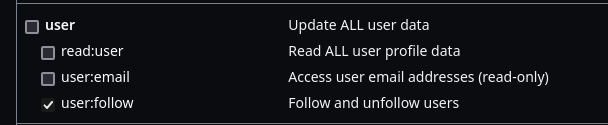

# HOW-TO

1. Create a "classic" GitHub personal access token (instructions: https://docs.github.com/en/authentication/keeping-your-account-and-data-secure/managing-your-personal-access-tokens#creating-a-personal-access-token-classic) and make sure it has the `user:follow` scope
    
2. Clone the repository, create a Python environment, install requirements, then set the `GH_TOKEN` environment variable to your token, then run `main.py`
    ```bash
   GH_TOKEN=ghp_xxxxxxxxxxxxxxxxxxx python main.py
   ```